# BeatNet `online` 경로 전용 C++ 구현 스펙 플랜

## 요약

- 최종 범위는 `online + PF` 경로만 C++로 옮기는 것이다. `offline/DBN`, `stream`, `realtime`, plotting, threading은 전부 범위 밖이다.
- 모델 추론 런타임은 `ONNX Runtime C++ API`로 고정한다. 런타임에서 실행하는 기본 아티팩트는 `waveform -> activations(T x 2)`까지 포함한 unified ONNX frontend 모델로 고정한다. 공식 런타임 버전은 `onnxruntime 1.24.4`다.
  - frontend ONNX export opset은 `17`로 고정한다.
- 구현 언어/빌드 기준은 `C++20 + CMake`로 고정한다.
- 구현 스타일은 `template` 메타프로그래밍과 `concept` 기반 조합을 우선 사용하고, class 상속과 virtual dispatch는 최소화한다.
- 입력 계약은 “이미 정규화된 22050 Hz, mono, `float32` PCM waveform buffer”로 고정한다. `sample_rate`, `hop_length`, `win_length`, `fps`는 공개 설정값이 아니라 내부 상수로 고정한다. 샘플레이트 감지, 리샘플링, 채널 합치기, 파일 포맷 디코딩, dtype 변환은 구현하지 않는다.
- 구현 대상은 `ONNX frontend(전처리 + CRNN 추론 + activation 후처리) -> PF 디코딩 -> beat/downbeat event 출력` 전체다.
- 전처리와 activation 후처리는 C++ 구현이 아니라 ONNX graph 내부로 고정한다. 다른 전처리/후처리 알고리즘 실험은 C++ 정책 교체가 아니라 다른 ONNX frontend 아티팩트 생성으로 수행한다.
- PF에서 사용하는 `madmom`의 bar 관련 함수는 C++로 직접 구현하고, Python `madmom` reference와 결과값을 비교하는 검증 파이프라인을 포함한다.
- 소스 코드는 기능별 디렉토리에 분류하고, 디렉토리 구조는 `대분류/중분류/소분류` 형식으로 고정한다.
- 각 소스 파일은 단일 책임을 유지하고 길이가 과도하게 커지지 않도록 쪼갠다. 구현 기준은 가급적 파일당 `200~300`라인 내외, `400`라인 초과 금지로 둔다.
- 새 소스, 테스트, 문서, 고정 자산은 모두 `re-impl/` 아래에 둔다.

## 공개 인터페이스와 산출물

- 새 디렉토리는 `re-impl/cpp_online/`로 고정한다.
- 빌드 시스템은 `CMake`로 고정하고, 프로젝트는 `CMAKE_CXX_STANDARD 20`을 사용한다. 라이브러리 타깃 이름은 `beatnet_online`으로 고정한다.
- 디렉토리 구성은 아래처럼 고정한다.
  - `include/beatnet/api/public/`
  - `include/beatnet/api/config/`
  - `include/beatnet/pipeline/policies/`
  - `include/beatnet/pipeline/concepts/`
  - `include/beatnet/frontend/onnx/`
  - `include/beatnet/frontend/artifacts/core/`
  - `include/beatnet/frontend/artifacts/validation/`
  - `include/beatnet/decode/bar/core/`
  - `include/beatnet/decode/bar/validation/`
  - `include/beatnet/decode/particle_filter/`
  - `src/core/orchestrator/`
  - `src/core/utils/`
  - `src/frontend/onnx/`
  - `src/frontend/artifacts/core/`
  - `src/frontend/artifacts/validation/`
  - `src/decode/bar/core/`
  - `src/decode/bar/validation/`
  - `src/decode/particle_filter/`
  - `cmake/deps/conan/`
  - `assets/`
  - `docs/`
  - `tools/onnx_build/frontend/`
  - `tools/onnx_build/frontend/preprocess/`
  - `tools/onnx_build/frontend/postprocess/`
  - `tools/onnx_build/frontend/merge/`
  - `tools/onnx_build/reference/`
  - `tests/`
- 의존성 공급 방식은 아래처럼 고정한다.
  - `Conan 2`를 필수 의존성 관리 방식으로 사용한다
  - `re-impl/cpp_online/conanfile.txt`를 저장소에 포함한다
  - `CMakeLists.txt`는 Conan toolchain 기반 구성을 전제로 한다
  - Conan을 사용할 수 없는 환경은 공식 빌드/배포 범위에서 제외한다
- 공개 C++ API는 아래 형태로 고정한다.

```cpp
namespace beatnet {

enum class ModelId { kModel1 = 1, kModel2 = 2, kModel3 = 3 };

struct OnlineConfig {
  ModelId model_id = ModelId::kModel1;
  std::filesystem::path frontend_model_path{};
  int particle_size = 1500;
  int down_particle_size = 250;
  float min_bpm = 55.0f;
  float max_bpm = 215.0f;
  int num_tempi = 300;
  float lambda_b = 60.0f;
  float lambda_d = 0.1f;
  float ig_threshold = 0.4f;
  int min_beats_per_bar = 2;
  int max_beats_per_bar = 4;
  uint32_t rng_seed = 1;
};

struct BeatEvent {
  double time_seconds;
  int label;  // 1 = downbeat, 2 = beat
};

template <typename T>
concept FrontendRunner = requires(
    const T& frontend,
    std::span<const float> waveform,
    int* num_frames) {
  { frontend.ComputeActivations(waveform, num_frames) } -> std::same_as<std::vector<float>>;
};

template <typename T>
concept Decoder = requires(
    T& decoder,
    std::span<const float> activations,
    int num_frames) {
  { decoder.Decode(activations, num_frames) } -> std::same_as<std::vector<BeatEvent>>;
};

struct DefaultFrontendTag {};
struct DefaultDecoderTag {};

class OnlineBeatNet {
 public:
  explicit OnlineBeatNet(OnlineConfig config = {});
  OnlineBeatNet(OnlineConfig config, std::filesystem::path frontend_model_path);
  std::vector<BeatEvent> Process(std::span<const float> mono_waveform_22050);
};

template <
    FrontendRunner TFrontendRunner,
    Decoder TDecoder>
class OnlineBeatNetPipeline {
 public:
  OnlineBeatNetPipeline(
      OnlineConfig config,
      TFrontendRunner frontend_runner,
      TDecoder decoder);

  std::vector<BeatEvent> Process(std::span<const float> mono_waveform_22050);
};
}
```

- 입력 검증 규칙은 명시적으로 문서화한다.
  - 입력은 1채널 `float32`, 22050 Hz, finite 값만 허용한다.
  - 이 계약을 어기면 즉시 에러를 반환한다.
  - 파일 경로 입력, stereo 입력, 다른 sample rate 입력은 지원하지 않는다.
  - 내부 시간축 상수는 공개 설정으로 노출하지 않는다.
    - `sample_rate = 22050`
    - `hop_length = 441`
    - `win_length = 1411`
    - `fps = 50`
- 에러 처리 계약은 아래처럼 고정한다.
  - 입력 계약 위반은 `std::invalid_argument`를 던진다.
  - ONNX 모델 로드/세션 생성/실행 실패는 `std::runtime_error`를 던진다.
  - 별도 custom exception hierarchy는 만들지 않는다.
- 내부 구성요소는 분리한다.
  - `FrontendRunner` concept
  - `Decoder` concept
  - `OnnxFrontendRunner`
  - `OnnxFrontendArtifactBuilder`
  - `OnnxFrontendReferenceValidator`
  - `BarStateSpace`
  - `BarTransitionModel`
  - `MadmomBarReferenceValidator`
  - `ParticleFilterDecoder`
  - `OnlineBeatNet` 오케스트레이터
- 기본 모듈 조합은 아래로 고정한다.
  - `OnnxFrontendRunner`
  - `ParticleFilterDecoder`
- 기본 사용자용 `OnlineBeatNet`은 위 기본 정책 타입들을 묶은 thin facade로 제공한다.
- 실험용 조합은 `OnlineBeatNetPipeline<TFrontendRunner, TDecoder>`로 고정한다.
- 상속 구조는 예외적으로 외부 라이브러리 적응 계층이 필요할 때만 허용하고, 내부 파이프라인 구현에서는 사용하지 않는다.
- ONNX 아티팩트는 아래처럼 고정한다.
  - 런타임 기본 아티팩트: `re-impl/models/online_frontend_model_{1,2,3}.onnx`
  - 선택적 디버그/검증 아티팩트: `re-impl/models/online_preprocess_model.onnx`, `re-impl/models/model_{1,2,3}.onnx`
- 모델 경로 선택 규칙은 아래처럼 고정한다.
  - 기본 동작은 `model_id`에 대응하는 번들 ONNX 모델을 사용하는 것이다.
  - `OnlineConfig.frontend_model_path`가 비어 있으면 `model_id`에 대응하는 번들 아티팩트를 사용한다.
  - `frontend_model_path`가 지정되면 `model_id`보다 우선한다.
  - `OnlineBeatNet(config, frontend_model_path)` 생성자 인자를 통해서도 동일한 override를 줄 수 있다.
  - 번들 아티팩트 규칙은 `re-impl/models/online_frontend_model_{model_id}.onnx`로 고정한다.
- 반환값은 기존 Python `online + PF`와 같은 의미를 유지한다.
  - `time_seconds`
  - `label=1` downbeat
  - `label=2` beat

## 구현 변경

- C++ 런타임 경계는 `waveform -> ONNX frontend -> activations(T, 2) -> PF decoder -> events`로 고정한다.
  - C++ 코드는 전처리, CRNN 추론, activation 후처리를 개별 단계로 재구현하지 않는다.
  - C++는 입력 검증, ONNX Runtime 실행, PF 디코더, 결과 반환만 담당한다.
- `tools/onnx_build/frontend/`에는 unified frontend ONNX 아티팩트를 생성하는 Python 빌더를 둔다.
  - 목표 아티팩트는 `re-impl/models/online_frontend_model_{1,2,3}.onnx`다.
  - 입력 계약은 `waveform[1, N] float32 @ 22050 Hz`로 고정한다.
  - 출력 계약은 `activations[T, 2] float32`로 고정한다.
  - 출력 layout은 row-major, axis `0=time`, axis `1=[beat, downbeat]`로 고정한다.
  - export opset은 `17`로 고정한다.
- ONNX frontend 내부 그래프는 아래 단계까지 모두 포함한다.
  - framing
  - windowing
  - `STFT`
  - magnitude / spectrogram 생성
  - fixed filterbank projection
  - logarithmic spectrogram
  - spectrogram difference
  - magnitude + diff stack으로 `(T, 272)` feature 생성
  - BDA CRNN 추론
  - class-axis softmax
  - `[:2, :]` 추출과 `(T, 2)` 재배열
- ONNX frontend의 STFT 관련 구현 원칙은 “원본 BeatNet/madmom 규약 우선”으로 고정한다.
  - 기준 구현은 [src/BeatNet/log_spect.py](/home/rrop/rropdb/box_inside/pdje/Distributable-BeatNet/src/BeatNet/log_spect.py:13)의 `SignalProcessor -> FramedSignalProcessor -> ShortTimeFourierTransformProcessor` 조합이다.
  - ONNX frontend의 frequency transform은 `ONNX STFT` 연산자로 고정한다.
  - ONNX builder는 원본 전처리의 외부 semantics 보존을 우선한다.
  - 외부 semantics는 `sample_rate=22050`, `hop_length=441`, `win_length=1411`, `fps=50`, 동일한 filterbank/log/diff 규약을 뜻한다.
  - `ONNX STFT` 내부의 FFT 알고리즘 구현은 별도 backend variant로 바꾸지 않는다.
  - 내부 FFT 알고리즘 차이로 인한 소규모 수치 차이는 허용하되, 기본 acceptance는 downstream feature/activation/event parity로 판단한다.
  - `win_length=1411`은 분석 창 길이로 고정하고, 이를 `1024/2048` 같은 다른 창 길이로 바꾸지 않는다.
  - 별도의 FFT backend 선택, DFT 대체 경로, 사용자 노출형 FFT 알고리즘 옵션은 두지 않는다.
  - `onesided/full spectrum`, 복소수 출력 layout, magnitude 계산 방식은 Python reference와 동일해야 한다.
  - window 함수는 Python reference에서 실제 사용된 계수를 자산으로 고정하고, ONNX graph는 그 상수를 직접 사용한다.
  - framing 규약은 첫 프레임 위치, 마지막 프레임 처리, padding 유무와 방향까지 포함해 reference 기준으로 고정한다.
- 전처리 수치 규약은 ONNX frontend 내부 상수로 고정한다.
  - `sample_rate = 22050`
  - `hop_length = 441`
  - `win_length = 1411`
  - `fps = 50`
  - filterbank 파라미터: `num_bands=24`, `fmin=30`, `fmax=17000`, `norm_filters=true`
  - log 파라미터: `mul=1`, `add=1`
  - diff 파라미터: `diff_ratio=0.5`, `positive_diffs=true`, `stack_diffs=np.hstack`
- ONNX frontend는 Python reference parity를 위해 generic mel 연산에 의존하지 않고, Python reference에서 생성한 고정 상수 자산을 사용한다.
  - window coefficients
  - filterbank matrix
  - diff 처리에 필요한 axis/shape metadata
  - framing/padding 규칙 검증용 reference tensors
- `OnnxFrontendArtifactBuilder`는 frontend graph를 단계별 subgraph로 만든 뒤 최종 unified graph로 병합한다.
  - `online_preprocess_model.onnx`: `waveform[1, N] -> features[T, 272]`
  - `model_{1,2,3}.onnx`: `features[1, T, 272] -> logits[1, 3, T]`
  - `online_frontend_model_{1,2,3}.onnx`: `waveform[1, N] -> activations[T, 2]`
- `OnnxFrontendReferenceValidator`는 Python `madmom + torch/onnxruntime` 기준 결과와 아래 산출물을 비교 검증한다.
  - STFT validation은 debug/diagnostic 목적으로 중간 스펙트럼 또는 magnitude reference를 비교할 수 있다.
  - preprocess output `(T, 272)`
  - logits `(1, 3, T)`
  - final activations `(T, 2)`
- `OnnxFrontendRunner`는 ONNX Runtime C++ API만 사용한다.
  - 입력 shape는 runtime에서 정확히 `(1, N)`으로 정규화한다.
  - 출력은 `(T, 2)` activations를 row-major contiguous buffer로 돌려준다.
  - `ComputeActivations()`는 flattened buffer 길이 `T * 2`와 `num_frames=T`를 함께 반환하는 것으로 간주한다.
  - C++ 쪽 softmax, slice, transpose 구현은 두지 않는다.
- `re-impl/cpp_online/decode`에는 `Decoder` concept를 만족하는 정책 타입들을 둔다.
  - `OnlineBeatNetPipeline`은 decoder policy type에만 의존하고, 후속으로 다른 online decoder가 필요할 경우 타입 교체만으로 바꿀 수 있게 한다
  - 기본 구현은 Python `particle_filter_cascade`를 기능 단위로 C++ 재구현한다.
  - 이 구현에는 Python 버전이 `madmom`에서 빌려 쓰는 `BarStateSpace`, `BarTransitionModel`, observation pointer 구성을 포함한다.
  - `re-impl/cpp_online/decode/bar`는 PF가 의존하는 bar 관련 수학/상태공간 모듈만 별도 분리해 독립 테스트 가능하게 만든다.
  - beat/downbeat 상태공간
  - beat transition model
  - observation model `"B56"`
  - information gate `0.4`
  - activation floor `0.03`
  - beat particle update
  - conditional downbeat particle update
  - universal resampling
  - 최종 event append 규칙
- PF 구현은 Python 기본 파라미터를 그대로 고정한다.
  - `particle_size=1500`
  - `down_particle_size=250`
  - `min_bpm=55`
  - `max_bpm=215`
  - `num_tempi=300`
  - `lambda_b=60`
  - `lambda_d=0.1`
  - `min_beats_per_bar=2`
  - `max_beats_per_bar=4`
  - `offset=0`
  - `ig_threshold=0.4`
- PF의 시간축 해석도 내부 상수에 고정한다.
  - `fps = 50`
  - `T = 1 / 50 = 0.02`
- RNG는 전역 난수가 아니라 디코더 인스턴스 내부 RNG로 고정한다.
  - 기본 seed는 `1`
  - 테스트 재현성을 위해 config에서 override 허용
- C++ 구현은 Python `online` 의미만 유지한다.
  - “전체 waveform을 받아 causal PF로 decode”하는 방식
  - 진짜 streaming/stateful incremental API는 이번 범위에서 만들지 않는다
- 모듈 교체 가능성은 compile-time policy injection 방식으로 고정한다.
  - `template`과 `concept`를 사용한 정적 조합을 우선한다
  - virtual interface와 런타임 polymorphism은 기본 설계에서 제외한다
  - 기본 사용자는 `OnlineBeatNet` facade만 쓰면 된다
  - 실험 사용자는 `OnlineBeatNetPipeline<...>`에 custom 정책 타입을 넣어 교체한다
- 파일 분할 기준은 아래처럼 고정한다.
  - 알고리즘 핵심 로직은 단계별로 파일 분리
  - ONNX frontend builder는 framing/window/STFT/filterbank/log/diff/merge 단계별로 파일 분리
  - bar state space, transition model, observation pointer, resampling, event emission은 각각 별도 파일
  - 상태공간 구성, observation 모델, resampling, event emission은 각각 별도 파일
  - 하나의 `.hpp`/`.cpp` 쌍이 여러 책임을 동시에 갖지 않게 유지

## DOT 그래프

- 아래 그래프를 `re-impl/cpp_online/docs/online_pipeline.dot`로 저장하고 README에도 같은 내용을 넣는다.

```dot
digraph BeatNetOnlineCpp {
  rankdir=LR;
  node [shape=box];

  input [label="Input waveform\nmono float32 PCM\n22050 Hz"];
  validate [label="Validate input contract\n(no resample, no remix,\nno file decode)"];
  frontend [label="ONNX frontend\nframe + window + STFT\n+ filterbank + log + diff\n+ CRNN + softmax + slice"];
  acts [label="Activations (T x 2)\nbeat, downbeat"];
  gate [label="PF pre-process\noffset=0\nmax over 2ch for beat gate\nIG threshold=0.4\nfloor=0.03"];
  beatpf [label="Beat particle filter\nmotion + correction + resample"];
  downpf [label="Downbeat particle filter\nconditional update"];
  emit [label="Emit events\n(time_seconds, label)\n1=downbeat, 2=beat"];

  input -> validate -> frontend -> acts -> gate -> beatpf;
  beatpf -> downpf -> emit;
}
```



## 테스트 계획

- Python reference generator를 `re-impl/cpp_online/tools/`에 두고, 현재 Python 구현에서 아래 golden fixture를 생성해 `re-impl/cpp_online/testdata/`에 저장한다.
  - `frontend_reference_<case>.npz`: `waveform`, `framed`, `windowed`, `stft_magnitude`, `features`, `logits`, `activations`
  - `bar_reference_<case>.npz`: state positions, first/last states, transition dense matrix, observation pointers
  - `events_reference_<case>.json`: final `online + PF` output event list
  - `reference_manifest.json`: fixture 버전, 생성 스크립트, source model id, tolerance metadata
  - 위 reference assets는 테스트에 필요한 최소 크기 데이터만 저장소에 커밋하고, 재생성 스크립트는 항상 함께 유지한다.
- ONNX preprocess validation test를 포함한다.
  - `online_preprocess_model.onnx` 출력 feature가 Python reference feature와 수치적으로 일치하는지 확인한다.
  - acceptance: `rtol=1e-4`, `atol=1e-5`
- ONNX STFT parity test를 포함한다.
  - framing 결과와 window 적용 결과가 Python `madmom` reference와 일치하는지 확인한다.
  - STFT magnitude 비교는 진단용 테스트로 유지하되, primary acceptance gate로 사용하지 않는다.
  - framing/window 단계는 hard acceptance gate로 사용한다.
- ONNX frontend 구조 검증 테스트를 포함한다.
  - unified frontend model이 waveform 입력과 `(T, 2)` activation 출력을 갖는지 확인한다.
  - preprocess-only / CRNN-only / unified frontend 아티팩트의 입출력 shape 계약이 일관적인지 확인한다.
- 모델 추론 테스트는 `model_{1,2,3}.onnx`가 Python ORT logits과 일치하는지 확인한다.
  - acceptance: `rtol=1e-4`, `atol=1e-5`
- activation postprocess 테스트는 unified frontend activation 출력이 Python softmax + `[:2, :]` 결과와 완전히 일치하는지 확인한다.
- bar 함수 검증 파이프라인을 포함한다.
  - Python `madmom`에서 생성한 `BarStateSpace`, transition dense matrix, observation pointers reference asset을 저장한다
  - C++ 구현이 같은 입력 파라미터에 대해 동일한 상태 수, state positions, first/last state, transition 확률, observation pointer를 생성하는지 검증한다
  - acceptance는 정수/인덱스 값은 exact match, 실수 값은 `rtol=1e-6`, `atol=1e-8`로 고정한다
  - 검증 범위는 `BarStateSpace`, `BarTransitionModel`, dense transition matrix materialization, `B56` observation pointer 생성까지로 고정한다
- 모듈 교체 테스트를 포함한다.
  - dummy frontend runner policy 주입 시 decoder 입력 직전 shape 검증이 가능한지 확인한다
  - dummy decoder policy 주입 시 upstream 출력이 예상 형태로 전달되는지 확인한다
  - compile-time concept 위반 타입이 빌드 단계에서 거부되는지 negative compile test를 둔다
- PF 단위 테스트는 hand-crafted activation 시퀀스로 아래 규칙을 검증한다.
  - information gate 적용
  - beat/downbeat state update
  - universal resampling 결과 shape
  - `label=1/2` event emission 규칙
- end-to-end 테스트는 적어도 아래 3종으로 고정한다.
  - `src/BeatNet/test_data/808kick120bpm.mp3`에서 생성한 waveform fixture
  - 일정한 BPM의 synthetic click track
  - 중간에 2x BPM jump가 들어간 synthetic tempo-change track
- end-to-end acceptance는 아래 기준으로 고정한다.
  - event count 차이 허용 범위: Python 대비 ±1 이내
  - 대응되는 beat/downbeat 시간 오차: 1 frame 이내 (`<= 0.02s`)
  - beat/downbeat label mismatch가 없어야 함
  - event 매칭은 label별로 분리한 뒤 time-sorted greedy monotonic nearest-neighbor 매칭으로 고정한다
  - 매칭 허용 범위는 `<= 0.02s`이고, 이 범위를 벗어난 이벤트는 unmatched로 처리한다
- 입력 계약 테스트도 포함한다.
  - wrong sample rate metadata path는 API에 존재하지 않아야 함
  - empty buffer는 empty result 반환
  - NaN/Inf 포함 input은 에러 반환
  - stereo-like 2채널 입력은 API 레벨에서 허용하지 않음
  - `sample_rate`, `hop_length`, `win_length`, `fps`가 공개 API에 노출되지 않는지 compile-time/API surface test로 확인한다
- 테스트 프레임워크는 `GoogleTest`로 고정한다.
  - Conan 사용 시 `gtest` 패키지를 사용한다
- 의존성 확보 테스트도 포함한다.
  - Conan toolchain 기반 구성에서 `onnxruntime/1.24.4`, `gtest`가 정상 해석되는지 확인한다
  - Conan 미지원 환경은 CI 및 공식 배포 대상에서 제외한다

## 가정 및 기본값

- 이번 스펙은 “기존 Python `online + PF` 경로를 C++에서 재현”하는 것이며, `offline/DBN`은 포함하지 않는다.
- 입력은 waveform부터 받되, waveform 포맷 변환은 호출자 책임으로 둔다.
- `sample_rate=22050`, `hop_length=441`, `win_length=1411`, `fps=50`은 내부 상수로 고정하고 공개 설정값으로 노출하지 않는다.
- 모델은 native C++ 재구현이 아니라 ONNX Runtime C++로 고정한다.
- 전처리, CRNN 추론, activation 후처리는 unified ONNX frontend 아티팩트 내부로 고정한다.
- ONNX frontend의 STFT 구현은 generic DSP 편의값이 아니라 원본 BeatNet/madmom semantics를 최대한 따르는 방향으로 고정한다.
- PF 디코더는 표준 ONNX graph에 넣지 않고 C++ 구현으로 유지한다.
- 빌드는 `CMake + C++20`으로 고정하며, 모듈 교체성은 template/concept 기반 정적 조합으로 구현한다.
- 의존성 공급은 `Conan 2`로 고정하고, Conan을 사용할 수 없는 환경은 지원 범위에서 제외한다.
- Python 대비 PF 내부 particle 상태 exact match는 목표로 두지 않고, 고정 seed 기반의 deterministic C++ 동작과 event-level parity만 목표로 둔다.
- `madmom`의 bar 관련 함수는 C++에 직접 구현하고, Python `madmom` reference와 비교 검증한다.
- 테스트 프레임워크는 `GoogleTest`로 고정한다.
- class 상속은 최소화하고, 코드 조직은 `대분류/중분류/소분류` 디렉토리 구조와 짧은 파일 단위 분해를 따른다.
- 출력 의미는 Python과 동일하게 유지한다.
- 새 코드, 새 문서, 새 테스트, 새 고정 자산은 모두 `re-impl/` 아래에만 둔다.
